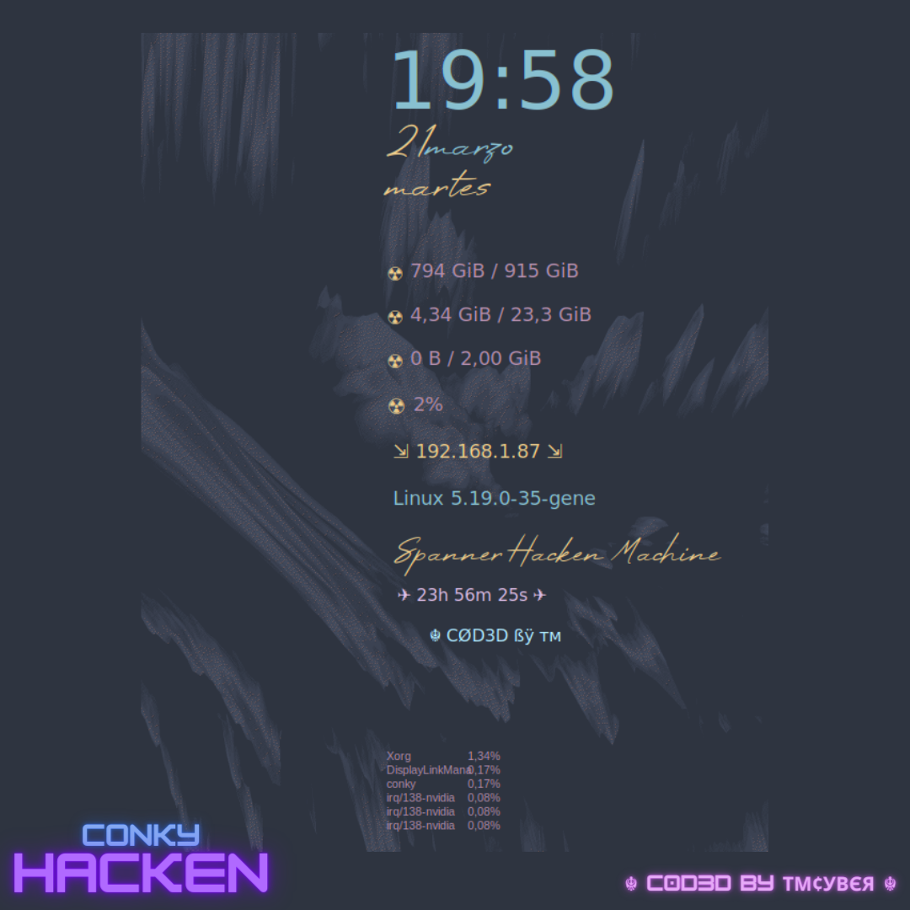

<h1 align="center">
   
  
</h1>

<h4 align="center">☣️ Conky Hacken `Spanner Hacken Machine` ☣️</h4>

---

<a href="https://github.com/tmcybers/Spanner-Hacken-Custom-Project">
<a href="https://github.com/tmcybers/Spanner-Hacken-Custom-Project">
<a href="https://github.com/tmcybers/Spanner-Hacken-Custom-Project">
<a href="https://github.com/tmcybers/Spanner-Hacken-Custom-Project">
<a href="https://github.com/tmcybers/Spanner-Hacken-Custom-Project/">
<a href="https://github.com/tmcybers/Spanner-Hacken-Custom-Project">
<a href="https://t.me/+l5WYQySOL-0yMDQ0">
<a href="https://twitter.com/tmcybers">
<a href="https://ioc.exchange/@tmcyber">
<a href="https://tmcybers.github.io/blog">
  <a href="https://wakatime.com/@tmcyber">
<a href="https://tmcybers.github.io/Donate">
<a href="https://ko-fi.com/tmcyber">

  
---

# ⚒️ Conky \ Hacken \ Machine ⚒️

# Important for You #

**Conky_Hacken is part of the (https://github.com/tmcybers/Spanner-Hacken-Custom-Project) Spanner Hacken Machine Custom\Scratch Project that is under constant Development and Updates I work on custom constantly, also on Conky_hacken**

